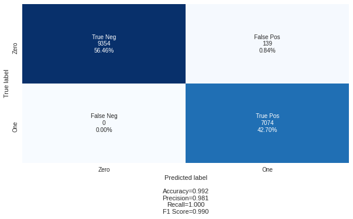

# Udacity Starbuck's Capstone Challenge

## Introduction

- This data set contains simulated data that mimics customer behavior on the Starbucks rewards mobile app. Once every few days, Starbucks sends out an offer to users of the mobile app. An offer can be merely an advertisement for a drink or an actual offer such as a discount or BOGO (buy one get one free). Some users might not receive any offer during certain weeks.

- Not all users receive the same offer, and that is the challenge to solve with this data set.

- Your task is to combine transaction, demographic and offer data to determine which demographic groups respond best to which offer type. This data set is a simplified version of the real Starbucks app because the underlying simulator only has one product whereas Starbucks actually sells dozens of products.

- Every offer has a validity period before the offer expires. As an example, a BOGO offer might be valid for only $5$ days. You'll see in the data set that informational offers have a validity period even though these ads are merely providing information about a product; for example, if an informational offer has 7 days of validity, you can assume the customer is feeling the influence of the offer for 7 days after receiving the advertisement.

- You'll be given transactional data showing user purchases made on the app including the timestamp of purchase and the amount of money spent on a purchase. This transactional data also has a record for each offer that a user receives as well as a record for when a user actually views the offer. There are also records for when a user completes an offer.

- Keep in mind as well that someone using the app might make a purchase through the app without having received an offer or seen an offer.


## Package Need

- [pandas](https://pandas.pydata.org/)
- [Sklearn](https://scikit-learn.org/stable/)
- [Numpy](https://numpy.org/)
- [Matplotlib](https://matplotlib.org/)
- [Seaborn](https://seaborn.pydata.org/)

## Data Sets

The data is contained in three files:

* portfolio.json - containing offer ids and meta data about each offer (duration, type, etc.)
* profile.json - demographic data for each customer
* transcript.json - records for transactions, offers received, offers viewed, and offers completed

Here is the schema and explanation of each variable in the files:

### profile.json

* `age` (int) - age of the customer 
* `became_member_on` (int) - date when customer created an app account
* `gender` (str) - gender of the customer (note some entries contain '`O`' for other rather than M or F)
* `id` (str) - customer id
* `income` (float) - customer's income

### portfolio.json

* `id` (string) - offer id
* `offer_type` (string) - type of offer ie BOGO, discount, informational
* `difficulty` (int) - minimum required spend to complete an offer
* `reward` (int) - reward given for completing an offer
* `duration` (int) - time for offer to be open, in days
* `channels` (list of strings)


### transcript.json

* `event` (`str`) - record description (ie transaction, offer received, offer viewed, etc.)
* `person` (`str`) - customer id
* `time` (`int`) - time in hours since start of test. The data begins at time `t=0`
* `value` - (`dict of strings`) - either an offer id or transaction amount depending on the record

## File Structure 

```txt

├── assets
├── data
│   ├── clean_portfolio.csv
│   ├── clean_profile.csv
│   ├── clean_transcript.csv
│   ├── overall_df.csv
│   ├── portfolio.json
│   ├── profile.json
│   └── transcript.json
├── README.md
├── Starbucks_Capstone_notebook.html
└── Starbucks_Capstone_notebook.ipynb

```


## Results

After using Logistic Regression i got this result 



