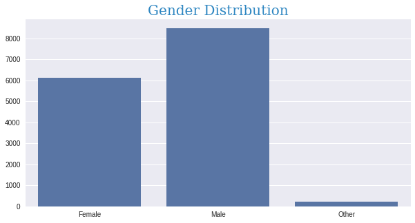
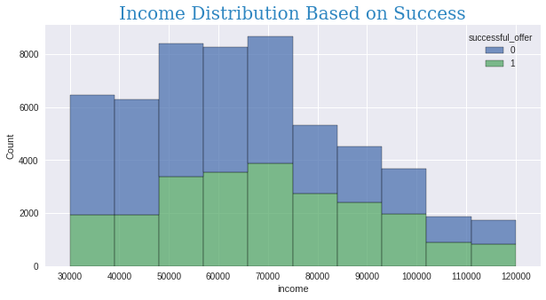

## Introduction

This project is my Capstone Challenge for Udacity’s Data Scientist Nanodegree. The project is in collaboration with Starbucks where we were given simulated data that mimics customer behavior on the Starbucks rewards app. The offer could be purely informational or it could include a discount such as BOGO (buy one get one free).

From the data we received, it appears that Starbucks sent 10 different offers to its customers via a variety of different channels.

For this project, we received 3 datasets —

1. **Portfolio** — dataset describing the characteristics of each offer type, including its offer type, difficulty, and duration.
2. **Profile** — dataset containing information regarding customer demographics including age, gender, income, and the date they created an account for Starbucks Rewards.
3. **Transcript** — dataset containing all the instances when a customer made a purchase, viewed an offer, received an offer, and completed an offer. It's important to note that if a customer completed an offer but never actually viewed the offer, then this does not count as a successful offer as the offer could not have changed the outcome.

## Project Goal

The goal of the project is build a model that **predicts whether or not someone will respond to an offer.** 

## The Steps of Project

1. **Assessing Datasets**
2. **Data Wrangling & Feature Engineering**
3. **Exploratory Analysis**
4. **Modeling** 

## Assessing Datasets

After make assessing to datasets i realize this observation 

**Profile Dataset**

- [x]  Convert the type of`became_member_on` column to date
- [x] `gender` column has $2175$ missing value so we need to remove it form dataset
- [x] `income`column has $2175$ missing value so we need to remove it form dataset
- [x] `age` column has $2175$ persons have $118$ years it seem to be outliers. we can also notice that is located in same row with `gender` and `income` that have `NaN` value
- [x] `id` column change his name to `customer_id`
- [x] `gender` column need to encode
- [x] `become_member_on` column need to encode

------

**Portfolio Dataset**

- [x]    `id` column change his name to `offer_id`
- [x] `channels` column need to encode
- [x] `offer_type` column need to encode

------

**Transcript Dataset**

- [x] `time` column convert to days
- [x] `person` column change his name to `customer_id`
- [x] `value` column extract `offer_id` and `amount`
- [x] `event` column need to encode

## Data Wrangling & Feature Engineering

After solving the observation problem we need to get offer data 

Now we need to define if the offer is successful or not and it can success if a customer completed an offer and viewed it and if not viewed the offer become not success offer

The final step in Data Wrangling is to merge dataset on `customer_id` and `offer_id` 

## Exploratory Analysis

### Gender Distribution

> we can notice that most of users are Male

### Income Distribution

> We can notice that the most income between $50000 \to 70000$

### Age Distribution

> We can notice that the most age is between 40 to 75

### New Member based of Year

> 2017 has the highest number of new members.

### New Member based of Month

> We can notice grow in member based on month is almost equal

### New Member based on Year and Gender

> We can notice that most of new member are Male

### Income based on Gender

> We can notice that the count Female gender is the highest one

### Event Distribution

> We can notice that most of offers are just received and viewed

### Distribution of Successful offers

> The Percentage of failure offers greater than success offers

## Distribution of Success based on offer type

> There are a lot of offers need to review because is not success like offer_8.
> offer_7, offer_9, offer_6 have a successful story

### Distribution of Offers based on Gender

> We can notice that male have more offers then female and that is normal because the count of male is more than female

### Distribution of Success based on Gender

### Distribution of of Success offers based on Gender

> We can notice that the success offer in female is more than the other despite of the male in data set is more than female

### Income Distribution Based on Success

> We can notice that the income does not have any role in the reject offers

## Modeling

In this step i will build a model that **predicts whether or not someone will respond to an offer**.

**First** i will prepare the dataset and create `X` and `y` data

**Second** create ML Pipeline

You realize from the above image that i standardize the dataset fist and then use Logistic Regression and classification model

**Third** Check the Accuracy

 

You can notice from the above image the accuracy is 0.99 and precision is 0.98 and recall is 1 and F1-score is 0.99 

